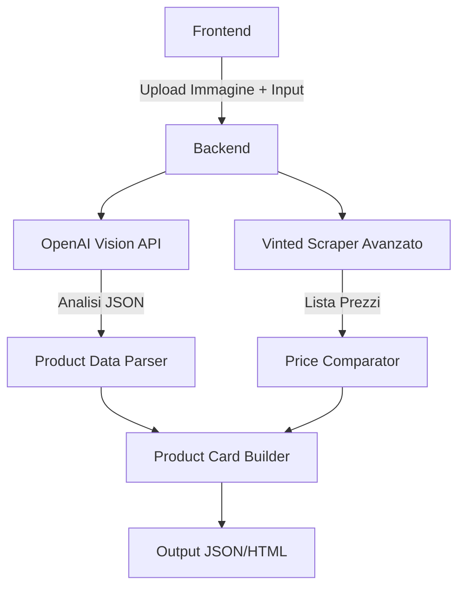
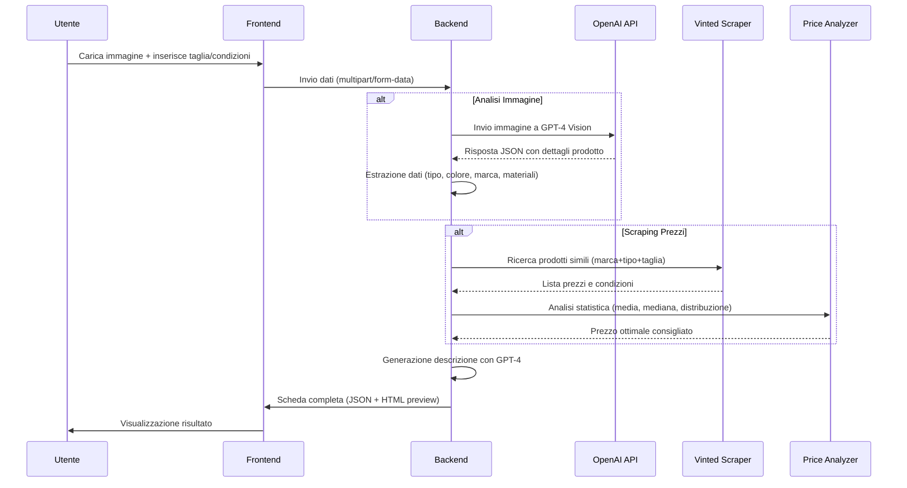

# Vinted AutoLister

A smart pipeline that transforms uploaded clothing images and minimal user inputs into a ready-to-publish Vinted product listing, complete with title, description, and price recommendation.

---

## Table of Contents

* [Overview](#overview)
* [Goals](#goals)
* [Architecture](#architecture)
* [Core Components](#core-components)
* [Data Flow & Context Management](#data-flow--context-management)
* [LLM Integration](#llm-integration)
* [Example Workflow](#example-workflow)
* [Technology Stack](#technology-stack)
* [Future Extensions](#future-extensions)
* [Contributing](#contributing)
* [License](#license)

---

## Overview

Vinted AutoLister allows users to upload an image of a clothing item and provide basic metadata (e.g. size, condition). The system uses a multimodal LLM (e.g., GPT-4 Vision) to analyze the image, generate descriptive text, and recommend a price by comparing with similar listings scraped from platforms like Vinted. The output is a JSON or HTML template, ready for manual or automated listing.

---

## Goals

* **Zero-Effort Listing**: Automate the creation of item listings with minimal input.
* **LLM-Powered Descriptions**: Use GPT-4 Vision and GPT-4 text to craft human-like titles and descriptions.
* **Dynamic Pricing**: Offer price suggestions based on live market data.
* **Multiplatform Ready**: Provide output in a structured format reusable across Vinted, eBay, Wallapop, etc.

---

## Architecture



**User Interface**: Web UI (Streamlit/Flask) for uploading images and entering item metadata.

**Image Processor**: Sends image to GPT-4 Vision and parses structured attributes (e.g., brand, type, color).

**Price Scraper**: Scrapes Vinted listings based on inferred attributes and computes pricing statistics.

**LLM Description Generator**: Prompts GPT-4 with extracted attributes to generate title + description.

**Product Card Builder**: Assembles all fields into a final listing structure.

**Output Layer**: Renders JSON/HTML, downloadable or copy-paste ready.

---

## Core Components

| Component             | Responsibility                                            |
| --------------------- | --------------------------------------------------------- |
| Image Upload UI       | Allow user to submit image and metadata                   |
| Vision Analyzer       | Extracts structured product data from image               |
| Price Scraper         | Searches Vinted for similar items and extracts price info |
| Price Analyzer        | Applies heuristics to recommend competitive pricing       |
| Description Generator | Creates human-like text for product description and title |
| Product Card Builder  | Combines fields into listing-ready output                 |
| Output Renderer       | Displays HTML preview or exports JSON                     |

---

## Data Flow & Context Management



### Input Phase

```json
{
  "image": "user_upload.jpg",
  "size": "M",
  "condition": "Ottimo"
}
```

### Processing Phase

* Vision API returns JSON:

```json
{
  "brand": "Nike",
  "type": "Felpa",
  "color": "Nero",
  "material": "Cotone"
}
```

* Price scraper returns listings data
* Description generator receives full prompt

### Output Phase

```json
{
  "title": "Felpa Nike nera unisex - Taglia M",
  "description": "Vendo felpa Nike originale...",
  "price": 13,
  "condition": "Ottimo",
  "category": "Uomo > Felpe",
  "size": "M"
}
```

---

## LLM Integration

### Vision API Prompt

```
Analyze this image of a clothing item. Return a JSON with the following fields:
- brand
- type (e.g., t-shirt, hoodie)
- color
- material (if visible)
```

### Description Prompt

```
Dati:
- Marca: Nike
- Tipo: Felpa
- Colore: Nero
- Taglia: M
- Condizione: Ottimo

Genera un titolo e una descrizione per Vinted, tono amichevole e chiaro.
```

---

## Example Workflow

**User Input:**

* Uploads image of black Nike hoodie
* Selects: Taglia M, Condizione Ottimo

**System Output:**

* Title: "Felpa Nike nera unisex - Taglia M"
* Description: "Vendo felpa Nike originale, colore nero, taglia M..."
* Price: 13€
* JSON + HTML preview ready

---

## Technology Stack

* **Backend**: Python 3.10+
* **Frontend**: Streamlit or Flask
* **LLM**: OpenAI GPT-4o (Vision + Text)
* **Scraping**: BeautifulSoup + requests/httpx
* **Output**: JSON + HTML templating (Jinja2)

---

## Future Extensions

* Upload multipli e gestione inventario
* Etichettatura automatica con QR
* Integrazione API con Vinted (se disponibile)
* Supporto multilingua
* SaaS dashboard per utenti

---

## Contributing

In futuro si potranno accettare contribuzioni esterne. Guidelines TBD.

---

## License

MIT o simile (da definire)
